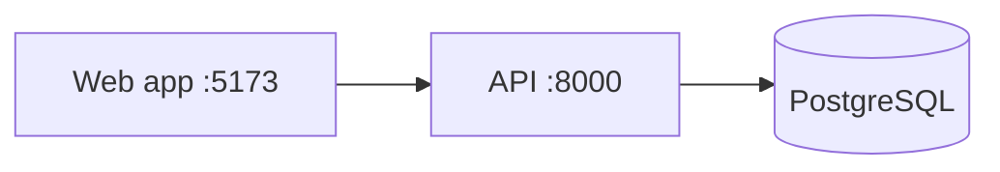

# Markdown patterns

Use a pattern only when it serves the reader. GitHub renders all of these;
check other surfaces before relying on HTML.

## Header block

A centered header suits public projects; plain Markdown suits internal
folders and materials.

```markdown
<div align="center">


# acme

**One-line pitch.**

[](https://github.com/<owner>/<repo>/actions/workflows/ci.yml)
[](https://www.npmjs.com/package/<package>)

[Quick start](#quick-start) · [Usage](#usage) · [Contributing](#contributing)

</div>
```

Keep blank lines inside the `<div>` so the Markdown in it renders.

## Badges

Add a badge only when its source exists, and link it to the page it
summarizes.

| Signal | Requires | Image URL |
| --- | --- | --- |
| CI status | A workflow file | `https://github.com/<owner>/<repo>/actions/workflows/<file>/badge.svg` |
| npm version | A published package | `https://img.shields.io/npm/v/<package>` |
| PyPI version | A published package | `https://img.shields.io/pypi/v/<package>` |
| License | A license file | `https://img.shields.io/badge/license-<SPDX-id>-blue` |
| Static label | Any verified fact | `https://img.shields.io/badge/<label>-<message>-<color>` |

In static badges, a single `-` separates fields: write a literal dash as `--`
(`license-Apache--2.0-blue`) and a space as `_` or `%20`.

## Alerts

```markdown
> [!WARNING]
> Restoring overwrites the target database.
```

Types: `NOTE`, `TIP`, `IMPORTANT`, `WARNING`, `CAUTION`. Use one or two per
README, never consecutive or nested.

## Collapsible detail

```markdown
<details>
<summary>All configuration options</summary>

| Option | Default | Description |
| --- | --- | --- |
| `timeout` | `30` | Seconds before a request fails |

</details>
```

Keep a blank line after `<summary>` so the Markdown inside renders.

## Theme-aware images

```html
<picture>
  <source media="(prefers-color-scheme: dark)" srcset="docs/logo-dark.svg">
  
</picture>
```

## Diagrams

GitHub renders Mermaid code blocks. Keep diagrams to the few boxes the reader
needs.

````markdown

````

## Anchors and links

- GitHub builds heading anchors by lowercasing, dropping punctuation, and
  turning spaces into hyphens; duplicates get `-1`, `-2`. Emoji drop out but
  their space stays: `## 🚀 Quick start` becomes `#-quick-start`.
- Relative links resolve against the current branch on GitHub. Package
  registry pages may not resolve them; use absolute URLs in READMEs published
  to a registry.
- GitHub shows the first README it finds in `.github/`, the root, then
  `docs/`, and truncates content past 500 KiB.

## Accessibility

- Alt text says what the image shows, without "image of".
- Link text names the destination; avoid "click here".
- Screen readers read each emoji's name aloud: avoid runs of emoji and emoji
  that carry meaning alone.
- Convey meaning with text, never with color alone.
