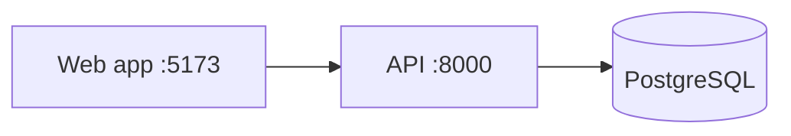

# Markdown patterns

Use a pattern only when it serves the reader on the surface that shows the
README. GitHub renders all of these. Some Git hosts, package registries, and
plain-file viewers render less: they may strip HTML, show an alert as a
quote that starts with a literal `[!WARNING]`, show a diagram as code, and
leave relative links or images unresolved. When the README shows on more
than one surface, use what the most limited one renders.

## Opening of an overview

For readers new to the project: the title, a pitch that stands out, and the
lead when the pitch needs one. Group badges and a navigation row under the
title when the README has them.

```markdown
# acme

**One-line pitch.**

[](https://github.com/<owner>/<repo>/actions/workflows/ci.yml)
[](https://www.npmjs.com/package/<package>)

[Quick start](#quick-start) · [Usage](#usage) · [Contributing](#contributing)

<Lead: what acme is for and what using it looks like, in two or three plain
sentences that do not restate the pitch.>
```

- Leave out a badge that has no source in the evidence; no badge is fine.
- In the navigation row, link the sections a first-time reader jumps to.

On a surface that renders HTML, the block from the title to the navigation
row can be centered inside one `<div>`, with a logo above the title when the
project has one:

```markdown
<div align="center">


# acme

**One-line pitch.**

<badges and the navigation row, as above>

</div>
```

Keep blank lines inside the `<div>` so the Markdown in it renders.

## Badges

Add a badge only when its source exists, and link it to the page it
summarizes.

| Signal | Requires | Image URL |
| --- | --- | --- |
| CI status | A workflow file | `https://github.com/<owner>/<repo>/actions/workflows/<file>/badge.svg` |
| npm version | A published package | `https://img.shields.io/npm/v/<package>` |
| PyPI version | A published package | `https://img.shields.io/pypi/v/<package>` |
| License | A license file | `https://img.shields.io/badge/license-<SPDX-id>-blue` |
| Static label | Any verified fact | `https://img.shields.io/badge/<label>-<message>-<color>` |

In static badges, a single `-` separates fields: write a literal dash as `--`
(`license-Apache--2.0-blue`), a literal underscore as `__`, and a space as
`_` or `%20`.

## Alerts

```markdown
> [!WARNING]
> Restoring overwrites the target database.
```

Types: `NOTE`, `TIP`, `IMPORTANT`, `WARNING`, `CAUTION`. Use one or two per
README, never consecutive. GitHub renders an alert only at the top level of
the page: inside a list item or `<details>` it shows as a quote that starts
with a literal `[!WARNING]`. Put the warning for a numbered step above the
list, or write it in the step as bold text.

## Collapsible detail

```markdown
<details>
<summary>All configuration options</summary>

| Option | Default | Description |
| --- | --- | --- |
| `timeout` | `30` | Seconds before a request fails |

</details>
```

Keep a blank line after `<summary>` so the Markdown inside renders, and
write a summary that names the content.

## Theme-aware images

```html
<picture>
  <source media="(prefers-color-scheme: dark)" srcset="docs/logo-dark.svg">
  
</picture>
```

## Diagrams

GitHub renders Mermaid code blocks. Keep diagrams to the few boxes the reader
needs.

````markdown

````

## Anchors and links

- GitHub builds heading anchors by lowercasing, dropping punctuation other
  than hyphens and underscores, and turning each space into a hyphen;
  duplicates get `-1`, `-2`. Emoji drop out but their space stays:
  `## 🚀 Quick start` becomes `#-quick-start`. An emoji typed with a
  variation selector (U+FE0F), as the gear and warning signs usually are,
  leaves that invisible character in the anchor: do not hand-build an anchor
  to such a heading, and leave an existing one as it is.
- A relative link or image path resolves from the folder of the README that
  holds it, on the current branch on GitHub: `packages/api/README.md` reaches
  the root README as `../../README.md`. A draft saved in another folder
  keeps the paths of the folder it will move to.
- Package registry pages may not resolve relative paths. When the evidence
  shows that a registry renders the README, such as a publish workflow (a
  `readme` field in the manifest alone does not show it), write the links
  and images you add to repository files as absolute URLs that those
  readers can open, with a branch or tag the evidence names. On GitHub a
  link is
  `https://github.com/<owner>/<repo>/blob/<ref>/<path>`, and an image needs
  the raw form, `https://raw.githubusercontent.com/<owner>/<repo>/<ref>/<path>`.
- GitHub shows the first README it finds in `.github/`, the root, then
  `docs/`, and truncates content past 500 KiB.

## Accessibility

- Alt text says what the image shows, without "image of".
- Link text names the destination; avoid "click here".
- Screen readers read each emoji's name aloud: avoid runs of emoji and emoji
  that carry meaning alone.
- Convey meaning with text, never with color alone.
